# NextGen Academy 🎓

<div align="center">

**A Modern Learning Management System Built with MERN Stack**

[](https://reactjs.org/)
[](https://nodejs.org/)
[](https://mongodb.com/)
[](https://expressjs.com/)
[](https://docker.com/)
[](https://kubernetes.io/)

*Empowering education through technology with AI integration and interactive learning experiences*

</div>

---

## 🏠 Home & Authentication

<div align="center">
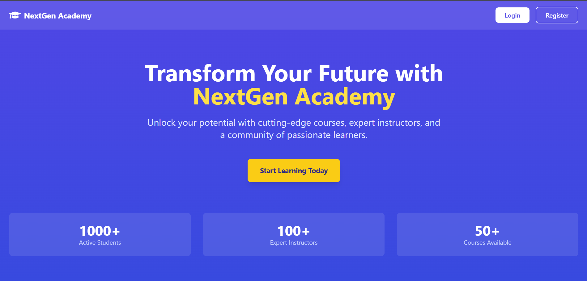
<p><em>Clean and modern homepage design with intuitive navigation</em></p>
</div>

<div align="center">
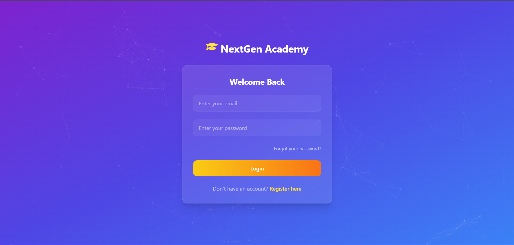
<p><em>Secure authentication with multiple login options</em></p>
</div>

---

## ✨ Key Features & Screenshots

### 👨‍🏫 **Instructor Dashboard & Management**

<details>
<summary><strong>📊 Admin Dashboard</strong></summary>
<br>
<div align="center">
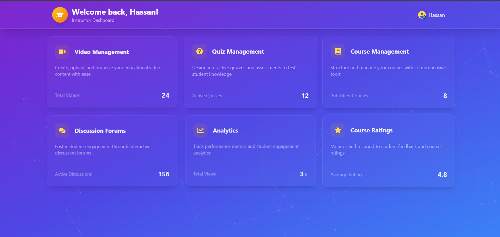
<p><em>Comprehensive admin panel with analytics, user management, and system overview</em></p>
</div>

**Features:**
- Real-time analytics and metrics
- User management and role assignment
- System health monitoring
- Revenue and enrollment tracking
- Quick access to all administrative functions
</details>

<details>
<summary><strong>📚 Course Management</strong></summary>
<br>
<div align="center">
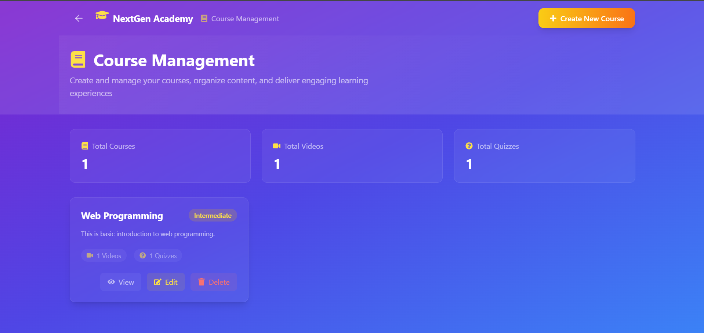
<p><em>Intuitive course creation and management interface</em></p>
</div>

**Features:**
- Create, edit, and delete courses
- Course curriculum planning
- Content organization and structuring
- Publishing and draft management
- Course analytics and performance metrics
</details>

<details>
<summary><strong>🎥 Video Management</strong></summary>
<br>
<div align="center">
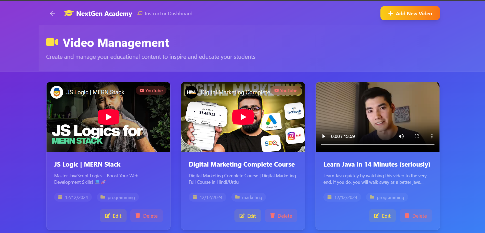
<p><em>Professional video management system with upload and organization tools</em></p>
</div>

**Features:**
- Video upload and processing
- YouTube integration
- Video organization and categorization
- Thumbnail management
- Video analytics and engagement metrics
</details>

<details>
<summary><strong>📝 Quiz Creation</strong></summary>
<br>
<div align="center">
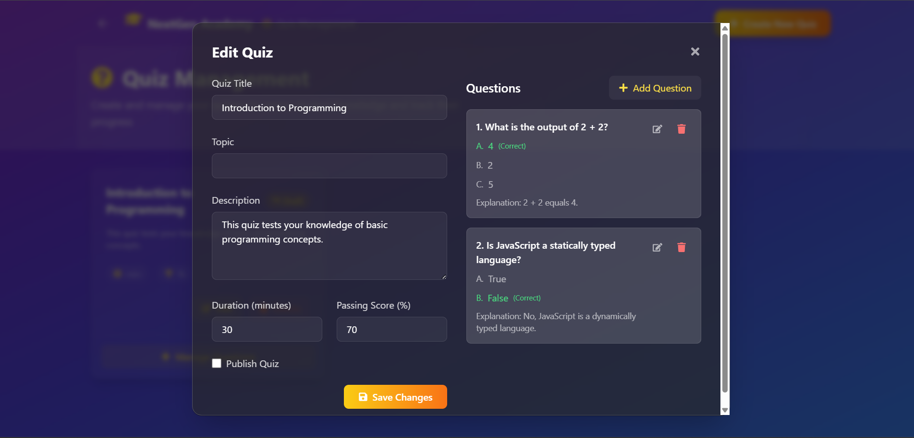
<p><em>Advanced quiz builder with multiple question types and customization options</em></p>
</div>

**Features:**
- Multiple question types (MCQ, True/False, Short Answer)
- Timer and deadline settings
- Automatic grading system
- Question bank management
- Performance analytics
</details>

<details>
<summary><strong>💬 Discussion Forums</strong></summary>
<br>
<div align="center">
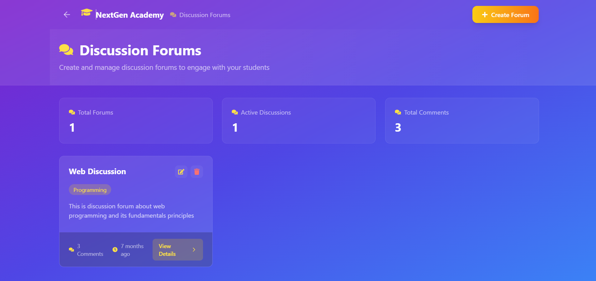
<p><em>Interactive discussion platform for course-related conversations</em></p>
</div>

**Features:**
- Course-specific discussion threads
- Real-time messaging
- Moderation tools
- File and media sharing
- User engagement tracking
</details>

### 👨‍🎓 **Student Experience**

<details>
<summary><strong>📱 Student Dashboard</strong></summary>
<br>
<div align="center">
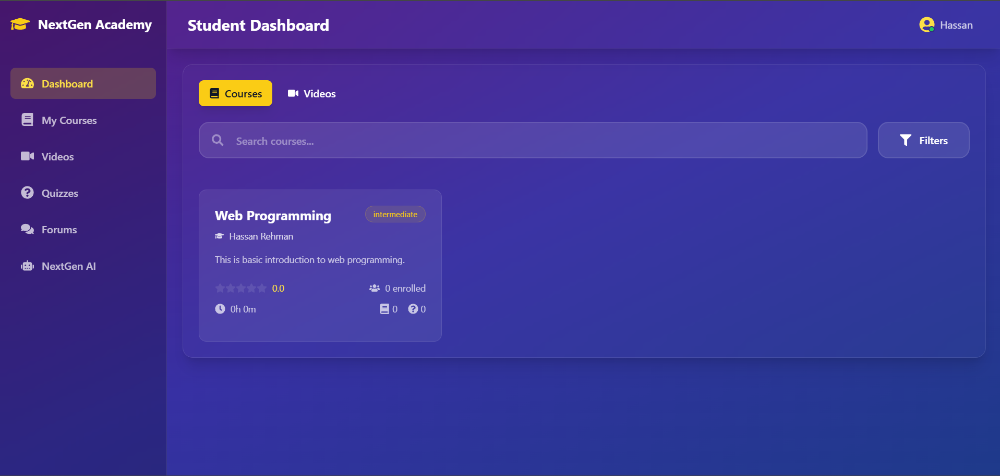
<p><em>Personalized student dashboard with progress tracking and quick access to courses</em></p>
</div>

**Features:**
- Course progress visualization
- Assignment and deadline tracking
- Performance analytics
- Recently accessed content
- Personalized recommendations
</details>

<details>
<summary><strong>🎬 Video Learning Experience</strong></summary>
<br>
<div align="center">
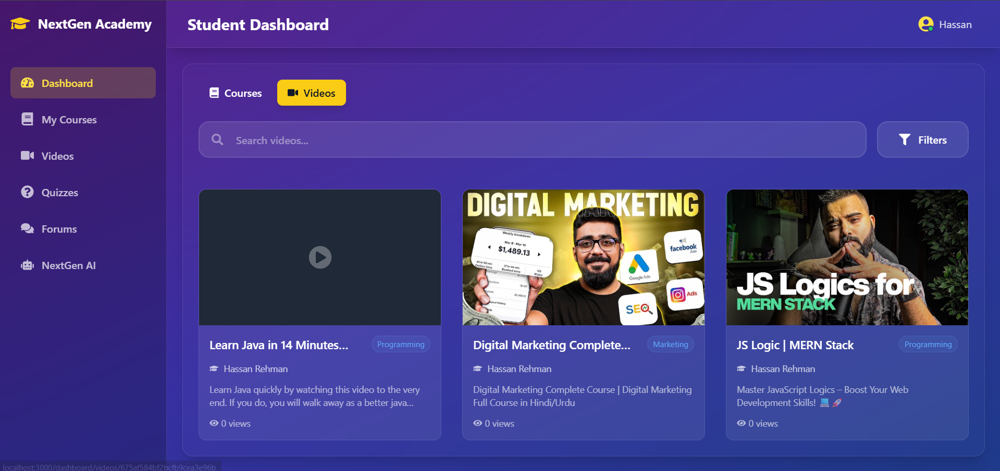
<p><em>Immersive video learning interface with progress tracking and interactive features</em></p>
</div>

**Features:**
- High-quality video streaming
- Progress tracking and bookmarking
- Playback speed control
- Note-taking capabilities
- Interactive transcripts
</details>

<details>
<summary><strong>💭 Student Discussion Forum</strong></summary>
<br>
<div align="center">
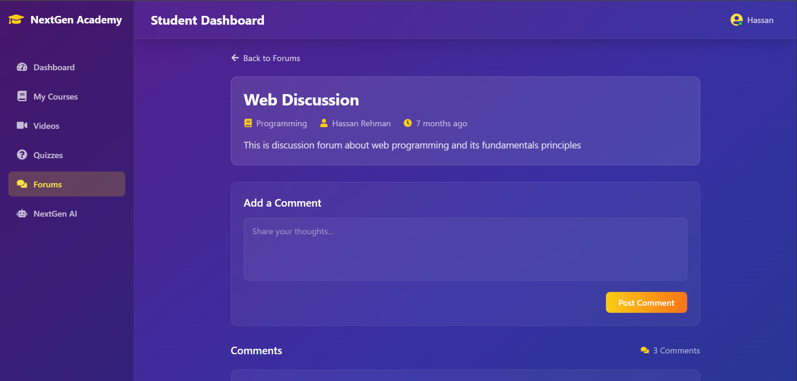
<p><em>Collaborative learning environment for peer-to-peer interaction</em></p>
</div>

**Features:**
- Peer interaction and collaboration
- Q&A with instructors
- Study group formation
- Resource sharing
- Community building
</details>

<details>
<summary><strong>🤖 AI-Powered Learning Assistant</strong></summary>
<br>
<div align="center">
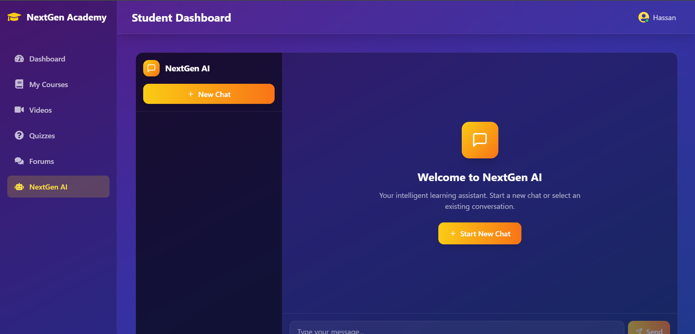
<p><em>Intelligent AI assistant powered by Google Gemini for personalized learning support</em></p>
</div>

**Features:**
- 24/7 learning assistance
- Personalized study recommendations
- Instant doubt resolution
- Progress analysis and suggestions
- Natural language interaction
</details>

---

## 🛠️ Technology Stack

<div align="center">

### Frontend Technologies
| Technology | Version | Purpose |
|------------|---------|---------|
|  | 18.x | UI Framework |
|  | 3.x | Styling |
|  | 6.x | Navigation |
|  | 10.x | Animations |

### Backend Technologies
| Technology | Version | Purpose |
|------------|---------|---------|
|  | 18.x | Runtime Environment |
|  | 4.x | Web Framework |
|  | 6.x | Database |
|  | - | Authentication |

### DevOps & Cloud
| Technology | Purpose |
|------------|---------|
|  | Containerization |
|  | Orchestration |
|  | CI/CD Pipeline |
|  | Media Storage |

</div>

## 🔌 Integrations & APIs

<div align="center">

| Service | Purpose | Status |
|---------|---------|--------|
| 🎥 **YouTube Data API** | Video integration and management | ✅ Active |
| 🔐 **Google OAuth 2.0** | Social authentication | ✅ Active |
| 🐙 **GitHub OAuth** | Developer authentication | ✅ Active |
| 🤖 **Google Gemini AI** | AI-powered learning assistant | ✅ Active |
| 📧 **Gmail SMTP** | Email notifications | ✅ Active |
| ☁️ **Cloudinary** | Media storage and optimization | ✅ Active |

</div>

---

## 🚀 Quick Start Guide

### 📋 Prerequisites

Ensure you have the following installed on your system:

```bash
# Check versions
node --version    # v18.x or higher
npm --version     # v8.x or higher
git --version     # v2.x or higher
```

### ⚡ Installation Steps

<details>
<summary><strong>1️⃣ Clone & Setup Repository</strong></summary>

```bash
# Clone the repository
git clone https://github.com/yourusername/NextGen-Academy.git
cd NextGen-Academy

# Install backend dependencies
cd backend
npm install

# Install frontend dependencies
cd ../frontend
npm install
```
</details>

<details>
<summary><strong>2️⃣ Environment Configuration</strong></summary>

**Backend Environment (`.env` in `backend/` directory):**
```env
# Database Configuration
MONGODB_URI=mongodb://localhost:27017/NextGenAcademy
JWT_SECRET=your_super_secret_jwt_key_here

# Server Configuration
PORT=8080
NODE_ENV=development

# Email Configuration
SMTP_USER=your_email@gmail.com
SMTP_PASS=your_app_specific_password

# OAuth Configuration
GOOGLE_CLIENT_ID=your_google_client_id
GOOGLE_CLIENT_SECRET=your_google_client_secret
GITHUB_CLIENT_ID=your_github_client_id
GITHUB_CLIENT_SECRET=your_github_client_secret

# API Keys
YOUTUBE_API_KEY=your_youtube_api_key
GOOGLE_AI_API_KEY=your_gemini_api_key

# Cloudinary Configuration
CLOUDINARY_CLOUD_NAME=your_cloudinary_name
CLOUDINARY_API_KEY=your_cloudinary_key
CLOUDINARY_API_SECRET=your_cloudinary_secret
```

**Frontend Environment (`.env` in `frontend/` directory):**
```env
# API Configuration
REACT_APP_API_URL=http://localhost:8080/api

# Cloudinary Configuration
REACT_APP_CLOUDINARY_CLOUD_NAME=your_cloudinary_name
REACT_APP_CLOUDINARY_API_KEY=your_cloudinary_key

# Feature Flags
REACT_APP_ENABLE_AI_CHAT=true
REACT_APP_ENABLE_SOCIAL_AUTH=true
```
</details>

<details>
<summary><strong>3️⃣ Database Setup</strong></summary>

```bash
# Start MongoDB service
# On Windows:
net start mongodb

# On macOS (with Homebrew):
brew services start mongodb-community

# On Linux:
sudo systemctl start mongod

# Verify MongoDB is running
mongosh --eval "db.adminCommand('ismaster')"
```
</details>

<details>
<summary><strong>4️⃣ Start the Application</strong></summary>

```bash
# Terminal 1 - Start Backend Server
cd backend
npm run dev    # Development mode with nodemon
# or
npm start      # Production mode

# Terminal 2 - Start Frontend Development Server
cd frontend
npm start

# Terminal 3 - Optional: MongoDB GUI
mongosh NextGenAcademy
```

**🎉 Your application should now be running:**
- **Frontend:** http://localhost:3000
- **Backend API:** http://localhost:8080
- **API Documentation:** http://localhost:8080/api-docs
</details>

---

## 🐳 Docker Deployment

### 🏗️ Build and Run with Docker

<details>
<summary><strong>Individual Container Setup</strong></summary>

```bash
# Build backend image
cd backend
docker build -t nextgen-academy-backend:latest .

# Build frontend image
cd ../frontend
docker build -t nextgen-academy-frontend:latest .

# Create a network for communication
docker network create nextgen-network

# Run MongoDB
docker run -d \
  --name nextgen-mongodb \
  --network nextgen-network \
  -p 27017:27017 \
  -e MONGO_INITDB_ROOT_USERNAME=admin \
  -e MONGO_INITDB_ROOT_PASSWORD=password \
  -e MONGO_INITDB_DATABASE=NextGenAcademy \
  mongo:latest

# Run backend
docker run -d \
  --name nextgen-backend \
  --network nextgen-network \
  -p 8080:8080 \
  -e MONGODB_URI=mongodb://nextgen-mongodb:27017/NextGenAcademy \
  nextgen-academy-backend:latest

# Run frontend
docker run -d \
  --name nextgen-frontend \
  --network nextgen-network \
  -p 3000:3000 \
  -e REACT_APP_API_URL=http://localhost:8080/api \
  nextgen-academy-frontend:latest
```
</details>

<details>
<summary><strong>Docker Compose Setup</strong></summary>

Create a `docker-compose.yml` file in the root directory:

```yaml
version: '3.8'
services:
  mongodb:
    image: mongo:latest
    container_name: nextgen-mongodb
    environment:
      MONGO_INITDB_ROOT_USERNAME: admin
      MONGO_INITDB_ROOT_PASSWORD: password
      MONGO_INITDB_DATABASE: NextGenAcademy
    ports:
      - "27017:27017"
    volumes:
      - mongodb_data:/data/db

  backend:
    build: ./backend
    container_name: nextgen-backend
    environment:
      MONGODB_URI: mongodb://mongodb:27017/NextGenAcademy
      JWT_SECRET: your_jwt_secret
      PORT: 8080
    ports:
      - "8080:8080"
    depends_on:
      - mongodb

  frontend:
    build: ./frontend
    container_name: nextgen-frontend
    environment:
      REACT_APP_API_URL: http://localhost:8080/api
    ports:
      - "3000:3000"
    depends_on:
      - backend

volumes:
  mongodb_data:
```

```bash
# Run with Docker Compose
docker-compose up -d

# Stop all services
docker-compose down

# View logs
docker-compose logs -f
```
</details>

---

## ☸️ Kubernetes Deployment

### 🎯 Deploy to Minikube

<details>
<summary><strong>Prerequisites & Setup</strong></summary>

```bash
# Install Minikube (Windows with Chocolatey)
choco install minikube

# Install kubectl
choco install kubernetes-cli

# Start Minikube
minikube start --cpus=4 --memory=4096 --disk-size=20g

# Configure Docker to use Minikube's daemon
minikube docker-env | Invoke-Expression

# Verify setup
kubectl get nodes
minikube status
```
</details>

<details>
<summary><strong>Deploy Application</strong></summary>

```bash
# Build images in Minikube's Docker environment
docker build -t nextgen-academy-backend:latest ./backend
docker build -t nextgen-academy-frontend:latest ./frontend

# Create namespace
kubectl apply -f kubernetes/namespace.yaml

# Deploy ConfigMaps and Secrets
kubectl apply -f kubernetes/backend-config.yaml

# Deploy MongoDB
kubectl apply -f kubernetes/mongodb-deployment.yaml
kubectl apply -f kubernetes/mongodb-service.yaml

# Deploy Backend
kubectl apply -f kubernetes/backend-deployment.yaml
kubectl apply -f kubernetes/backend-service.yaml

# Deploy Frontend
kubectl apply -f kubernetes/frontend-deployment.yaml
kubectl apply -f kubernetes/frontend-service.yaml

# Or deploy everything at once
kubectl apply -k kubernetes/
```
</details>

<details>
<summary><strong>Access & Monitor</strong></summary>

```bash
# Get all resources
kubectl get all -n nextgen-academy

# Access the application
minikube service frontend -n nextgen-academy

# Monitor pods
kubectl get pods -n nextgen-academy -w

# Check logs
kubectl logs -f deployment/backend -n nextgen-academy
kubectl logs -f deployment/frontend -n nextgen-academy

# Port forwarding for local access
kubectl port-forward -n nextgen-academy svc/frontend 3000:3000
kubectl port-forward -n nextgen-academy svc/backend 8080:8080
```
</details>

---

## 🔄 CI/CD Pipeline

### GitHub Actions Workflow

Our automated CI/CD pipeline includes:

- ✅ **Code Quality Checks**
- ✅ **Automated Testing**
- ✅ **Docker Image Building**
- ✅ **Container Registry Push**
- ✅ **Kubernetes Deployment**
- ✅ **Health Checks**

<details>
<summary><strong>Pipeline Configuration</strong></summary>

The pipeline is configured in `.github/workflows/deploy.yml` and includes:

1. **Build Stage**
   - Code checkout
   - Dependency installation
   - Unit tests execution
   - Docker image building

2. **Test Stage**
   - Integration tests
   - Security scanning
   - Code coverage analysis

3. **Deploy Stage**
   - Push to Docker Hub
   - Deploy to Kubernetes
   - Health verification
   - Rollback on failure

**Required GitHub Secrets:**
```
DOCKER_USERNAME=your_dockerhub_username
DOCKER_PASSWORD=your_dockerhub_token
KUBE_CONFIG=your_kubernetes_config
```
</details>

---

## 📊 Project Metrics & Performance

<div align="center">

### 📈 Application Statistics

| Metric | Value |
|--------|-------|
| 🏗️ **Total Components** | 45+ React Components |
| 🛣️ **API Endpoints** | 25+ REST APIs |
| 📱 **Responsive Breakpoints** | 4 (Mobile, Tablet, Desktop, XL) |
| ⚡ **Performance Score** | 90+ (Lighthouse) |
| 🔒 **Security Rating** | A+ |
| 📦 **Bundle Size** | < 2MB (Gzipped) |

### 🎯 Browser Support

| Browser | Version | Support |
|---------|---------|---------|
| Chrome | 90+ | ✅ Full |
| Firefox | 88+ | ✅ Full |
| Safari | 14+ | ✅ Full |
| Edge | 90+ | ✅ Full |

</div>

---

## 🤝 Contributing

We welcome contributions! Please follow these steps:

<details>
<summary><strong>Development Workflow</strong></summary>

1. **Fork the repository**
2. **Create a feature branch**
   ```bash
   git checkout -b feature/amazing-feature
   ```
3. **Make your changes**
4. **Add tests for new functionality**
5. **Commit your changes**
   ```bash
   git commit -m "Add amazing feature"
   ```
6. **Push to your branch**
   ```bash
   git push origin feature/amazing-feature
   ```
7. **Open a Pull Request**

</details>

<details>
<summary><strong>Code Standards</strong></summary>

- Follow ESLint configuration
- Write meaningful commit messages
- Add JSDoc comments for functions
- Maintain 80%+ test coverage
- Use semantic versioning

</details>

---

## 📄 License

This project is licensed under the **MIT License** - see the [LICENSE](LICENSE) file for details.

---

### 📞 Contact & Support

<div align="center">

[](https://github.com/yourusername/NextGen-Academy)
[](https://github.com/yourusername/NextGen-Academy/issues)
[](https://github.com/yourusername/NextGen-Academy/discussions)

**Made with ❤️ by the NextGen Academy Team**

</div>

</div>

---

<div align="center">
<sub>⭐ Star this repository if you found it helpful!</sub>
</div>
